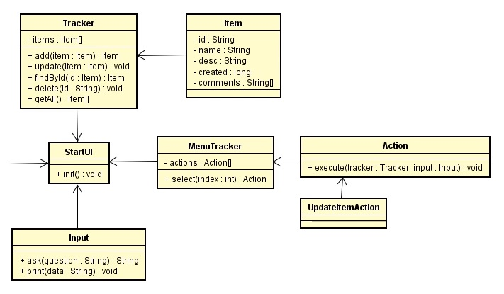

# Репозиторий Бориса Брахина
Репозиторий содержит практический материал Job4j. 

Ниже находятся наиболее интересные проекты, которые я реализовал во время обучения

<b>1. Трекер заявок (JDBC, PostgreSQL)</b>
    Основной модуль : <a href="https://github.com/brakhin/job4j/blob/master/1_chapter_002/src/main/java/ru/bgbrakhi/tracker/StartUI.java">StartUI.java</a>
    Ссылка : https://github.com/brakhin/job4j/tree/master/1_chapter_002 
    UML-схема :
    
